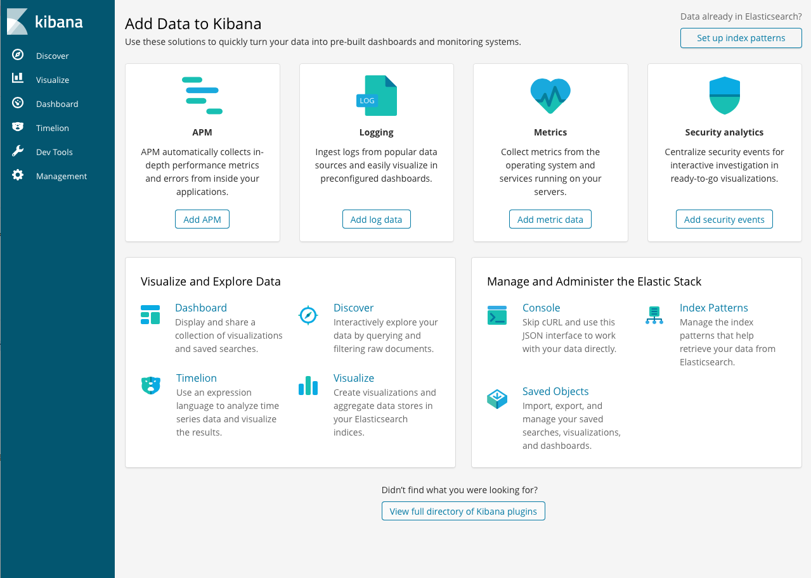
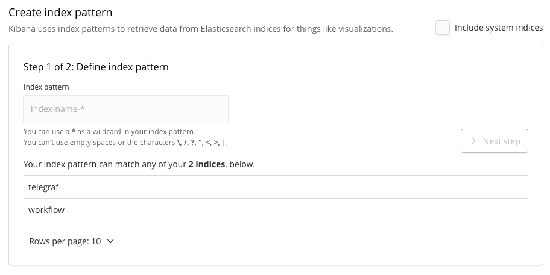
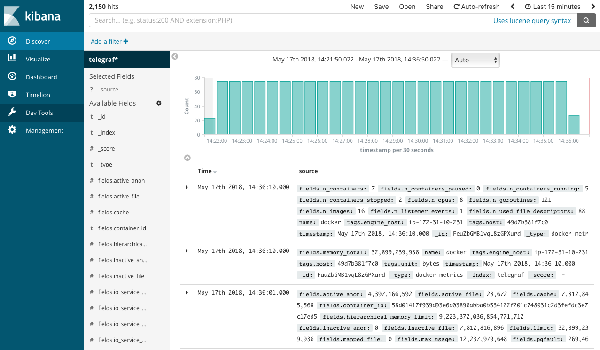
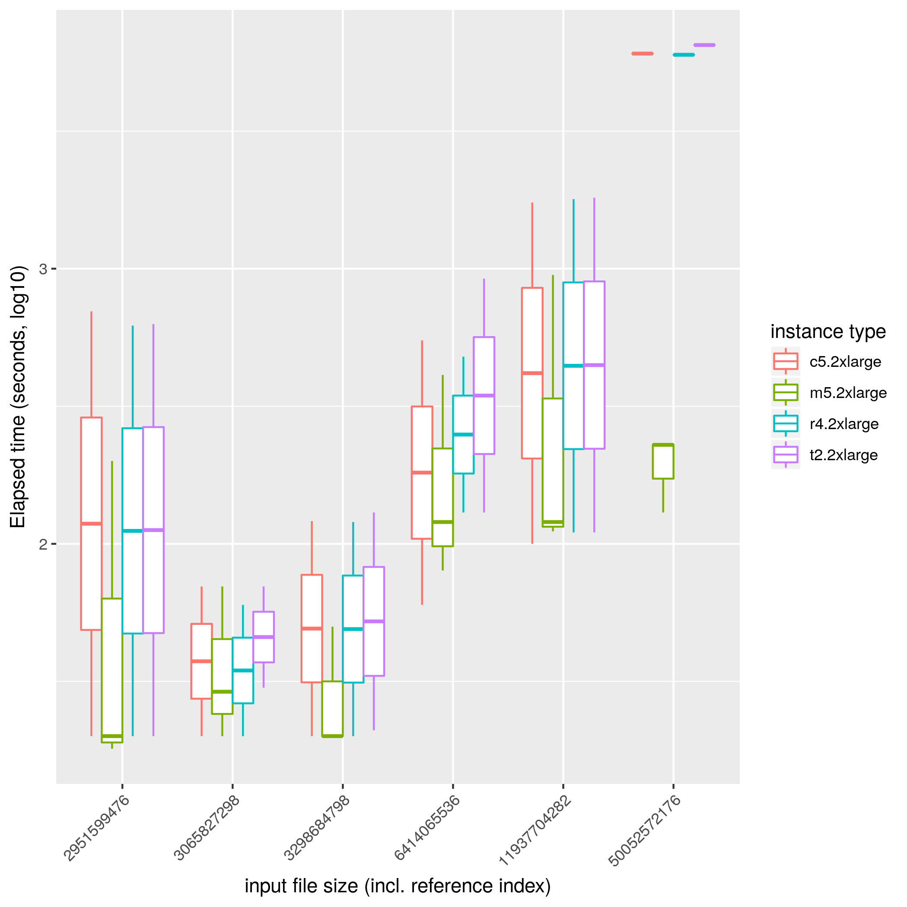
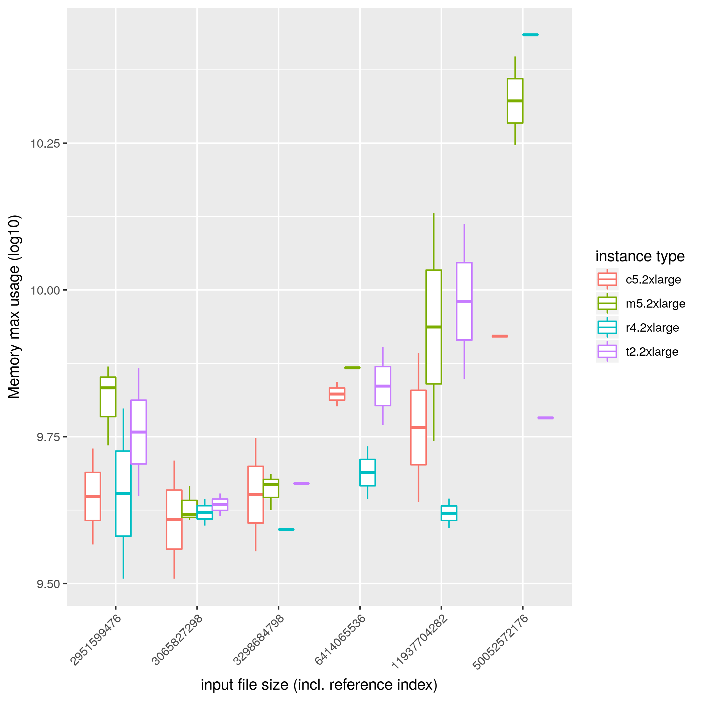

Container virtualization technology to improve portability of software tools is getting popular everywhere: also in the field of Bioinformatics/Computational biology, where many data analysis tools for many study purposes are implemented and distributed as open source software, the containers are helping people to maintain their data analysis environment. The new community standard [Common Workflow Language (CWL)](https://www.commonwl.org) is also contributing to making it easy to share workflows, a set of tools packaged in containers.

In the era of big genomic data, researchers need more machines as much more data is coming. This situation pushes to make tools and workflows portable to use cloud computing services which offer on-demand flexible computational environments. However, to optimize the use of cloud environments users have to know which cloud instance is the best for their purposes - based on the resource usage metrics of tools and workflows.

[CWL-metrics](https://github.com/inutano/cwl-metrics) is a framework to collect and analyze computational resource usage of workflow runs based on the CWL. CWL-metrics launches a daemon process to catch `cwltool` processes, [Telegraf](https://github.com/influxdata/telegraf) to collect the resource usage via docker API, and [Elasticsearch](https://github.com/elastic/elasticsearch) to store the collected data.

## Prerequisites

- `git`
- `curl`
- `perl`
- `docker`
- `docker-compose` (version 3)
- `cwltool`

## Install

Use `curl` to fetch the install script from GitHub and exec via bash command as:

```
$ curl "https://raw.githubusercontent.com/inutano/cwl-metrics/master/bin/cwl-metrics" | bash
```

This will do followings:

- Check prerequisites
- Create `$HOME/.cwlmetrics`
- Fetch required tools
  - CWL-metrics daemon script (this repository)
  - [docker-metrics-collector](https://github.com/inutano/docker-metrics-collector) repository
  - [cwl-log-generator](https://github.com/inutano/cwl-log-generator) docker container
  - [cwl-metrics-client](https://github.com/inutano/cwl-metrics-client) docker container
- Generate config files
- Run CWL-metrics

Installing CWL-spec will pull the following containers to your host environment:

- `telegraf` for collecting container metrics
- `sebp/elk` for Elasticsearch and Kibana
- `quay.io/inutano/run-dmc` for setting up docker-metrics-collector
- `quay.io/inutano/fluentd` for sending log data to Elasticsearch
- `quay.io/inutano/cwl-log-generator` for processing workflow metadata
- `quay.io/inutano/cwl-metrics-client` for summarizing metrics data

## Usage

### Launch CWL-metrics system

CWL-metrics will start automatically after the installation. The `cwl-metrics` command is at `$HOME/.cwlmetrics/bin/cwl-metrics`. `chmod +x $HOME/.cwlmetrics/bin/cwl-metrics` and `export PATH=$HOME/.cwlmetrics/bin:$PATH` would be useful to execute the command wherever you need.

Do any of followings to control CWL-metrics:

- `cwl-metrics status`: shows if the system is running
- `cwl-metrics start`: launches the metrics collection system
- `cwl-metrics stop`: stops the metrics collection system

### Collect workflow resource usage

CWL-metrics is using [cwllog-generator](https://github.com/inutano/cwl-log-generator) for extracting workflow metadata. The current version of cwllog-generator supports only `cwltool` for CWL execution engine, and require some options on running. While the system is running, run `cwltool` with options below to collect workflow metadata:

- `--debug`
- `--leave-container`
- `--timestamps`
- `--compute-checksum`
- `--record-container-id`
- `--cidfile-dir </path/to/container_id_dir>`
- `--outdir </path/to/cwl_result_dir>`
- `2> </path/to/debug_output_log_file>` (redirect stderr to a file)

Example:

```
$ cwl-metrics start
$ cwl-metrics status
cwl-metrics is running.
$ cd /home/inutano/workflows/kallisto
$ ls
kallisto.cwl kallisto.yml
$ mkdir result
$ cwltool --debug --leave-container --timestamps --compute-checksum --record-container-id --cidfile-dir $(pwd)/result --outdir $(pwd)/result kallisto.cwl kallisto.yml 2> $(pwd)/result/cwltool.log
```

### Visualize data on Elasticsearch/Kibana

Collected metrics data are stored in Elasticsearch which exposes the port 9022. To check the status of the Elasticsearch server, run the following command:

```
$ curl localhost:9200/_cluster/health?pretty=true
{
  "cluster_name" : "elasticsearch",
  "status" : "yellow",
  "timed_out" : false,
  "number_of_nodes" : 1,
  "number_of_data_nodes" : 1,
  "active_primary_shards" : 11,
  "active_shards" : 11,
  "relocating_shards" : 0,
  "initializing_shards" : 0,
  "unassigned_shards" : 10,
  "delayed_unassigned_shards" : 0,
  "number_of_pending_tasks" : 0,
  "number_of_in_flight_fetch" : 0,
  "task_max_waiting_in_queue_millis" : 0,
  "active_shards_percent_as_number" : 52.38095238095239
}
```

To visualize the collected metrics data, Kibana is also available via port 5601. Access the Kibana server from `localhost:5601`, and you will see the dashboard screen like below:



Click "Set up index patterns".



In this screen you have to create an index pattern while we have only two indices named "telegraf" and "workflow", which contain the metrics data and workflow metadata, respectively. Type "telegraf" to filter the indices, and click "next step". In the next step you have to configure time filter field name. Click the drop down, and select "timestamp", then click "Create index pattern". Once the index pattern successfully created, visit "Discover" in the left side menu. You will see the timeline of collected data and the list of records like the screenshot below.



In this screen you can see all the data stored in the Elasticsearch server, and Kibana has some useful visualization tools which can aggregate data and draw plots, but the raw telegraf metrics data are pieces of metrics for each 5 seconds of workflow runs, which has to be concatenated. To get simple statistics like total memory usage by workflow runs, use the `cwl-metrics fetch` command explained in the next section.

### Summarize data by `cwl-metrics fetch`

`cwl-metrics fetch` is a command to execute [cwl-metrics-client](http://github.com/inutano/cwl-metrics-client) to fetch metrics data from the Elasticsearch server and aggregate metrics with the workflow metadata. The output format is JSON or TSV.

To get metrics summary in JSON (result is simplified):

```
$ cwl-metrics fetch json | jq .
{
	"CWL-metrics":[
	{
	  	"workflow_id":"48813280-5990-11e8-9693-0aafe96a2914",
	  	"workflow_name":"KallistoWorkflow-se.cwl",
	  	"platform":{
	  		"instance_type":"m5.2xlarge",
	  		"region":"us-east-1a",
	  		"hostname":"ip-172-31-10-231.ec2.internal"
	  	},
	  	"steps":{
	  		"135df0da59c968f22d1e394c9412cb9c3fa4580cf62616790ff79ffa162c7911":{
	  			"stepname":"kallisto_quant",
	  			"container_name":"yyabuki/kallisto:0.43.1",
	  			"tool_version":"0.43.1",
	  			"tool_status":"success",
	  			"input_files":{
	  				"SRR1274306.fastq":229279368,
	  				"GRCh38Gencode":2836547930
	  			},
	  			"metrics":{
	  				"cpu_total_percent":99.7522093765586,
	  				"memory_max_usage":4053995520,
	  				"memory_cache":152821760,
	  				"blkio_total_bytes":51630080,
	  				"elapsed_time":40
	  			}
	  		}
		}
	}]
}
```

in TSV:

```
$ cwl-metrics fetch tsv
container_id    stepname        instance_type   cpu_total_percent       memory_max_usage        memory_cache    blkio_total_bytes       elapsed_time    workflow_id     workflow_name   container_name  tool_version    tool_status     total_inputfile_size
7fc27d4d335a    kallisto_quant   m5.2xlarge             6811197440      2909052928      2956857344      20      1acbecae-5990-11e8-9693-0aafe96a2914    KallistoWorkflow-se.cwl yyabuki/kallisto:0.43.1 0.43.1  success 2951599476
```

And you can use any software you like to visualize the result! Below is an example that compared execution time and amount of used memory of the Kallisto workflow executions for 5 samples of different file sizes on 4 different instances.




